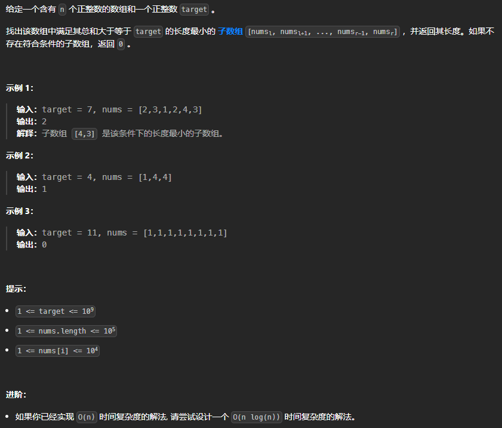
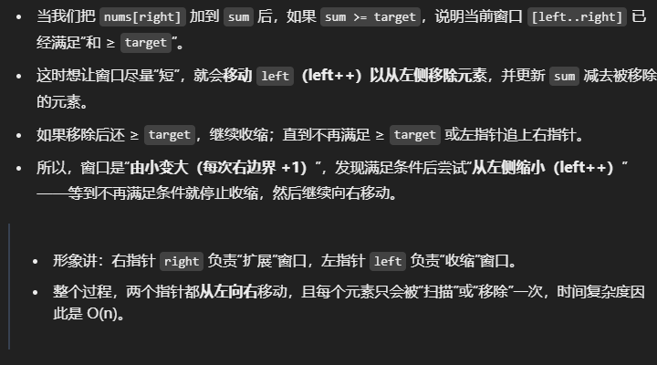
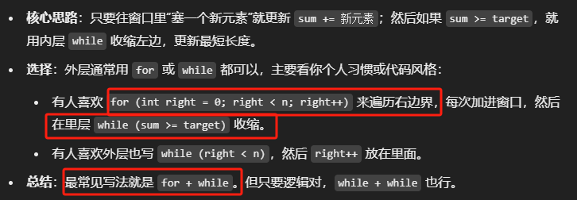
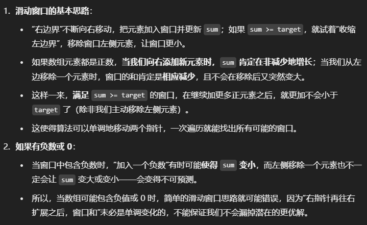
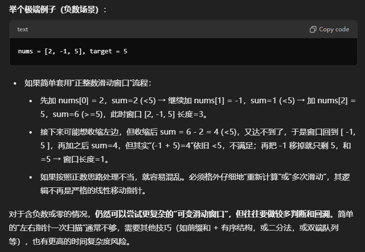

**2025.1.10** 18:43
## 难度 <span style="color:orange">Medium</span>
link: https://leetcode.cn/problems/minimum-size-subarray-sum/description/<br>
tag：数组，双指针, 滑动窗口，前缀和，二分查找<br>

## 题目

## 题解
#### 题目分析
看到题目后第一感觉就是一个可以用 **双指针方法**解决的题型。由此衍生出**几个问题**：
1. 双指针的初始化位置
2. 窗口如何收缩？--由大变小还是由小变大，从左向右还是从右向左？
3. 使用什么方法进行累加？--用`while`还是`for`？
4. 最外层`while`的结束条件是什么？<br>

**核心思路**
- 使用两个指针（start 和 end）维护一个滑动窗口。
- 让 end 从左向右遍历，每加入一个元素就更新当前窗口的和；
一旦当前窗口和 `≥ target`，就尝试在**保持** `>= target` 的前提下，“收缩”窗口左边（移动 start），以获得更短的子数组；
- 同时记录最短的满足条件的子数组长度。
- 该方法在最坏情况下，每个元素被“end”访问一次，又被“start”访问一次，所以整体仍为 O(n)。
```java
class Solution {
    public int minSubArrayLen(int target, int[] nums) {
        int n = nums.length;
        int left = 0;            // 滑动窗口左边界
        int sum = 0;            // 当前窗口的元素和
        int minLen = Integer.MAX_VALUE; // 记录满足条件的最小长度

        for (int right = 0; right < n; right++) {
            sum += nums[right]; // 把右侧新元素纳入窗口

            // 当窗口和 >= target 时，开始收缩左边界
            while (sum >= target) {
                // 更新最小长度
                int currentLen = right - left + 1;
                if (currentLen < minLen) {
                    minLen = currentLen;
                }
                // 把左侧元素移出窗口
                sum -= nums[left];
                left++;
            }
        }

        // 若 minLen 仍是 Integer.MAX_VALUE，表示没有找到满足条件的子数组
        return (minLen == Integer.MAX_VALUE) ? 0 : minLen;
    }
}
```

`int minLen = Integer.MAX_VALUE;` 这是什么意思？<br>
**用途**: 这是一个常见的“初始化”做法，用来记录“目前已找到的最小子数组长度”的变量。因为我们还没开始找，所以要先把它设成一个很大的值——`Integer.MAX_VALUE` 就代表一个很大的整数。<br>
**逻辑含义**：  如果到最终都没能找到任何和 `≥ target` 的子数组，那么 `minLen` 会保持不变。我们根据“它是否依旧是 Integer.MAX_VALUE”来判断是否找到过有效子数组。
```java
if (minLen == Integer.MAX_VALUE) {
    return 0; // 没找到任何符合条件的子数组
} else {
    return minLen;
}
```
### 回答一开始提出的几个问题
1. 为什么要用 `Integer.MAX_VALUE`：它是 Java 中 int 能表示的最大值（约 21 亿），任何正常计算得到的子数组长度都不会超过数组本身长度，所以一定能被后续的“最小值”比较所替代。
2. 双指针初始化：通常 `left = 0`、`sum = 0`，然后用 `right` **从头到尾** (从0开始遍历到数组末尾）扫描数组；“窗口”的概念就是 `[left..right]`。
3. 窗口如何收缩？：<br>
4. 使用什么方式进行累加？：<br>
5. 最外层循环结束条件：`right` 遍历整个数组`（right < nums.length）`就结束；因为这样才能**保证所有可能的子数组都检查到**。
## 另外的问题
这道题为什么强调**正整数数组**？如果不是正整数数组会怎么样？能用滑动窗口解吗？<br>
❣️**核心**：滑动窗口需要“**窗口和**”具有“**只增不减**”的特性（当右指针往右扩时），或至少可以判断当我们缩小窗口后是否还会再次满足条件。


### 如果不是正整数数组怎么办？
可以使用 `Prefix Sum` + 二分/哈希/平衡树<br>

对于含有负数、零的情形，通常不再能用常规滑动窗口，需要更复杂的数据结构或方法。
比如使用前缀和并保存在一个容器里，结合二分搜索或其它方式寻找满足 prefixSum[j] - prefixSum[i] >= target 的子数组。但这往往会是O(nlogn)、甚至更高的复杂度。<br>
**特定场景下仍可优化**
例如若数组中负数的规模很少或有某些额外限制，有时可以做特判；或者若数组为单调递增 + 少数负数，也有某些特定解法。
但总之，再没有“全部正数”这种单调特性时，就不能直接套“滑动窗口”。
### 小结
- 之所以题目强调“**正整数数组**”：因为只有在所有元素都 > 0 时，**滑动窗口（左右指针）**才会是一个简洁可靠的**线性扫法**，能在 O(n) 时间内完成“最短子数组和 `≥ target`”的查找。
- 如果包含**负数或 0**：则无法保证窗口和随“右指针右移”一定是单调不减的，也无法保证“左指针收缩后”不会错失更好的解。此时常用 前缀和 + 二分查找 或其他更复杂的技巧来解决，通常复杂度达 O(nlogn) 或更高。
- ❣️总结：正整数是使滑动窗口成为线性时间可行方案的必要条件。若不是正整数，就需要换别的思路。
