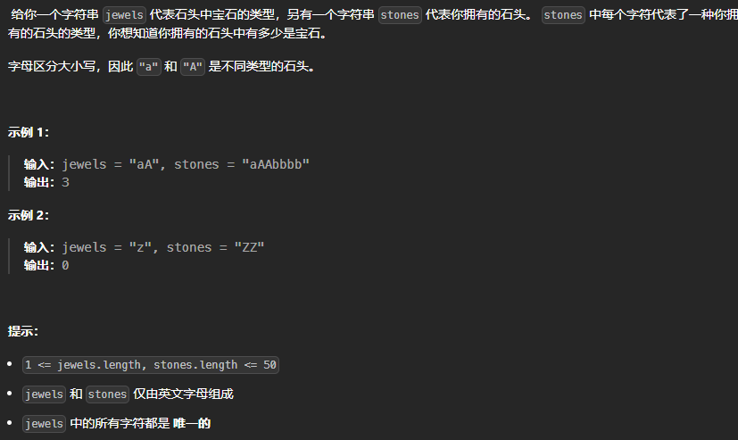

**2025.1.11** 18:43
## 难度 <span style="color:green">Easy</span>
link: https://leetcode.cn/problems/jewels-and-stones/description/<br>
tag：哈希表，字符串<br>
参考视频：<a href='https://www.bilibili.com/video/BV13G4y1m7n3/?spm_id_from=333.337.search-card.all.click&vd_source=9d8f6fe56371abfae7fe0a76b8a06bab'>15分钟玩转HashSet</a>
## 题目

## 题解
### 题目分析
1. 执行什么操作？→ 查询
2. 什么数据结构查询比较快？→ set → HashSet
3. 搞清楚是谁查谁？→ 挨个查stones的character有没有在jewels中 → 将jewels放入HashSet中<br>
<span style="color: red; font-weight: bold;">数据结构与算法的关系：算法是解决问题的步骤，根据算法选择合适的数据结构</span>
<br>

```java
class Solution {
    public int numJewelsInStones(String jewels, String stones) {
        //initialize HashSet
        Set<Character> set = new HashSet<>( jewels.length() << 1);
        //fill jewels into set
        for(int i = 0; i < jewels.length(); i++){
            set.add(jewels.charAt(i));
        }

        //search char from set
        int result = 0;
        for(int i = 0; i < stones.length(); i++){
            if(set.contains(stones.charAt(i))){
                result++;
            }
        }
        return result;
    }
}
```

## 🆘注意

<br>

`jewels.length() << 1`是初始化`HashSet`容量。
→ 为什么要初始化容量？
- 避免频繁的扩容：<br>
`HashSet` 的底层是 `HashMap`，`HashMap` 会在存储元素超过负载因子（默认是 0.75）时进行扩容。
扩容是一个开销较大的操作，会涉及到数组的重新分配和数据的重新哈希。
通过初始化适当的容量，可以减少扩容次数，提高性能。
**减少内存浪费：**
如果知道将要存储的元素数量，提前初始化容量可以避免 HashSet 分配过多或过少的内存。<br>

- `jewels.length() << 1`的含义：`<< 1` 是左移运算符，表示将数值左移 `1` 位，相当于将数值乘以 `2`。
在这个例子中，`jewels.length()` 是一个字符串的长度，通过左移操作乘以 `2`，设置为 `HashSet` 的初始容量。<br>
**原因：**
`HashSet` 的底层 `HashMap` 默认负载因子是 0.75。
为了存储 `n` 个元素并避免扩容，容量应设置为至少 `n / 0.75`，约等于 `n * 1.33`。
为了进一步优化，直接设置为 `n * 2` 是一个常见的做法，因为容量通常是 `2 的幂`。