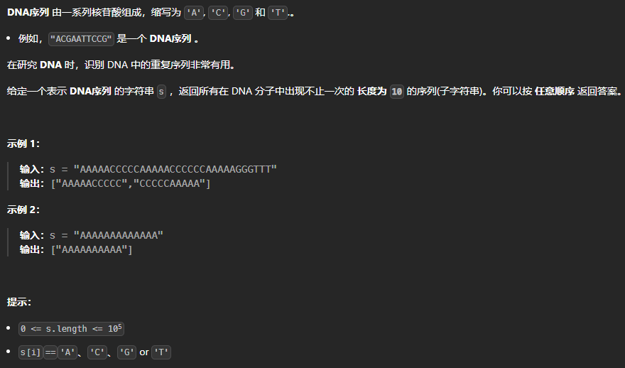

**2025.1.16** 11:36
## 难度 <span style="color:orange">Medium</span>
link: https://leetcode.cn/problems/repeated-dna-sequences/description/?envType=problem-list-v2&envId=sliding-window<br>
tag：哈希表，字符串，滑动窗口，位运算<br>

## 题目

## 题解
```java
class Solution {
    public List<String> findRepeatedDnaSequences(String s) {
        // 定义结果列表
        List<String> result = new ArrayList<>();

        // 如果字符串长度小于10，直接返回空列表
        if (s.length() <= 10) return result;

        // 使用一个HashSet来存储已经出现过的子串
        Set<String> seen = new HashSet<>();

        // 使用另一个HashSet来存储重复出现的子串
        Set<String> repeated = new HashSet<>();

        // 遍历字符串，取长度为10的所有子串
        for (int i = 0; i <= s.length() - 10; i++) {
            String substring = s.substring(i, i + 10);
            // 如果seen已经包含该子串，则加入repeated
            if (!seen.add(substring)) {
                repeated.add(substring);
            }
        }

        // 将repeated中的所有子串加入结果列表
        result.addAll(repeated);
        return result;
}
}
```
## 🆘注意
1. 要使用2个HashSet存放子串，因为子串有可能重复多次，如果搜索到重复子串后直接插入List中，会导致多次插入重复串，所以要多使用一个repeated来去重。
