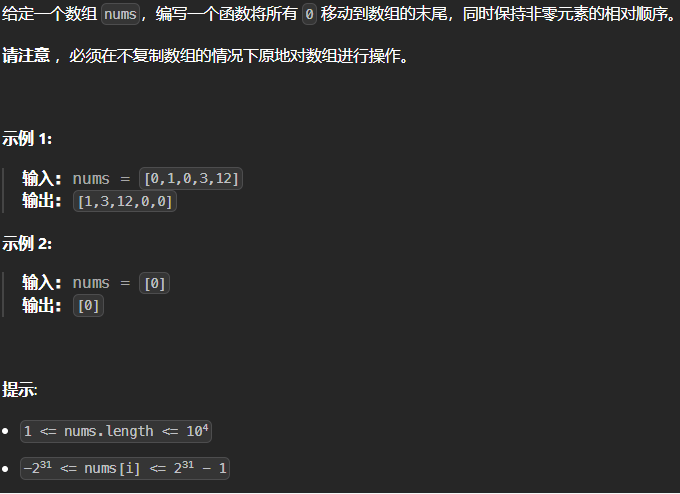

**2025.1.18** 21:47
## 难度 <span style="color:GREEN">Easy</span>
link: https://leetcode.cn/problems/move-zeroes/description/<br>
tag：数组 双指针<br>

参考视频：[NeetCode-Move Zeroes LeetCode283](https://www.google.com/search?q=LeetCode283&oq=LeetCode283&gs_lcrp=EgZjaHJvbWUyBggAEEUYOTIJCAEQABgKGIAEMgkIAhAAGAoYgAQyCQgDEAAYChiABDIJCAQQABgKGIAEMgkIBRAAGAoYgAQyCQgGEAAYChiABDIJCAcQABgKGIAEMgkICBAAGAoYgAQyCQgJEAAYChiABNIBCTMzODNqMGoxNagCCLACAQ&sourceid=chrome&ie=UTF-8#fpstate=ive&vld=cid:384c78b2,vid:aayNRwUN3Do,st:0)

## 题目


## 题解
```java
class Solution {
    public void moveZeroes(int[] nums) {
        int p = 0;

        for(int k = 0; k<nums.length; k++){
            if(nums[k] != 0){
                int temp = nums[k];
                nums[k] = nums[p];
                nums[p] = temp;

                p++;
            }
        }
    }
}
```

## 分析
**在不复制数组的情况下原地对数组进行操作**<br>
这句话是什么意思？<br>
意思是最基础的解法是先遍历原数组，使用两个数组分别存放0和非零元素，最后将两个数组合并。<br>


**这题要反向思维**:把0都放到数组右侧 = 把非零数都放到数组左侧
这样就很自然而然地想到要用一个指针R遍历数组判断是否为非零数，另一个指针L指向数组左侧下一个非零数应该待的位置。如果判断为非零数，则交换两指针所指元素，并将L右移一位。