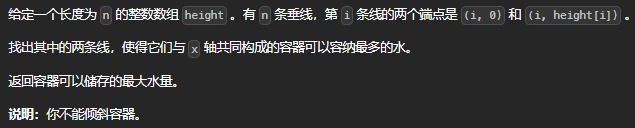
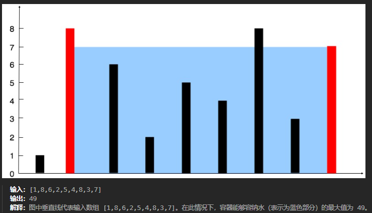

**2025.01.19** 23:00
## 难度 <span style="color:orange">Medium</span>
link: https://leetcode.cn/problems/repeated-dna-sequences/description/?envType=problem-list-v2&envId=sliding-window<br>
tag：数组，双指针<br>

## 题目

### 示例1

### 示例2
输入：height = [1,1]<br>
输出：1
## 题解

### 原始解（超时）
```java
class Solution {
    public int maxArea(int[] height) {
        HashSet<Integer> set = new HashSet<>();
        if(height.length == 1){
            return 0;
        } else{
            for(int start = 0; start< height.length;start++){
                for(int end = start + 1; end < height.length; end++){
                    //计算水量
                    int x = end - start;
                    int h = Math.min(height[start], height[end]);
                    int container = x * h;
                    //将计算后的水量插进hashSet中
                    if(!set.contains(container)){
                        set.add(container);
                    }
                }
            }        

            List<Integer> sortedList = new ArrayList<>(set);
            Collections.sort(sortedList);//对计算出的所有水量排序
            int max = Collections.max(sortedList);//返回最大水量

            return max;
        }
        
    }
}
```
#### 优化分析
✅**问题 1：不必要的 HashSet 和排序**<br>
使用了 `HashSet` 来存储所有可能的容器面积，并通过 `Collections.max` 找到最大值。这种方法虽然可行，但性能低效：<br>

使用 `HashSet` 和排序增加了额外的时间复杂度。
实际上，只需要记录当前最大面积，而不需要存储所有面积。<br>
**优化方式：**<br>
直接在计算面积的过程中，<span style= "color:red">维护一个变量记录最大值</span>，无需额外的数据结构。

✅**问题 2：算法效率低（O(n²)）**
使用了两层嵌套循环来遍历所有可能的左右柱组合，时间复杂度为 `O(n²)`。对于较大的输入，这种方法性能会非常差。<br>

**优化方式：**<br>

可以使用双指针法，将时间复杂度优化到 `O(n)。`

### 优化后的代码
```java
class Solution {
    public int maxArea(int[] height) {
        int maxArea = 0;
        int left = 0;  // 左指针
        int right = height.length - 1;  // 右指针

        while (left < right) {
            // 计算当前面积
            int width = right - left;
            int h = Math.min(height[left], height[right]);
            int area = width * h;

            // 更新最大面积
            maxArea = Math.max(maxArea, area);

            // 移动指针：总是移动较小的高度
            if (height[left] < height[right]) {
                left++;
            } else {
                right--;
            }
        }

        return maxArea;
    }
}
```
**更新最大面积：**<br>
使用 `maxArea = Math.max(maxArea, area)`。
**移动指针：**<br>
总是移动高度较小的指针：
如果 `height[left]` < `height[right]`，说明瓶颈在左侧，移动 `left`。
否则，移动`right`。