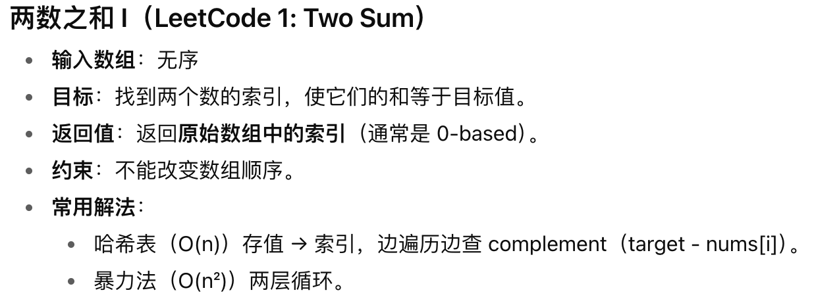
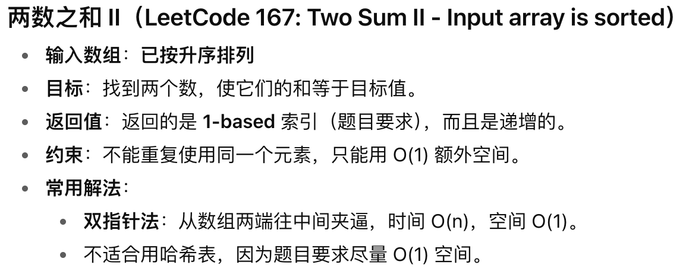
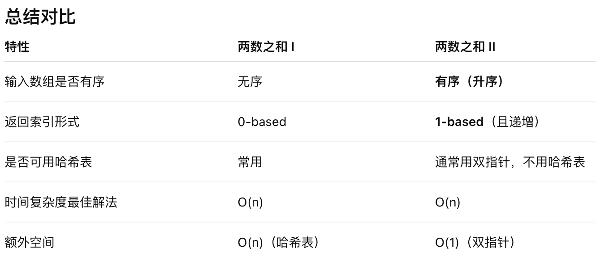

link：https://leetcode.cn/problems/two-sum-ii-input-array-is-sorted/description/

## 题目
给你一个下标从 1 开始的整数数组 `numbers` ，该数组已按非递减顺序排列，请你从数组中找出满足相加之和等于目标数 `target` 的两个数。如果设这两个数分别是 `numbers[index1]` 和 `numbers[index2]` ，则 `1 <= index1 < index2 <= numbers.length` 。

以长度为 2 的整数数组 `[index1, index2]` 的形式返回这两个整数的下标 `index1 `和 `index2`。

你可以假设每个输入只对应唯一的答案 ，而且你不可以重复使用相同的元素。

你所设计的解决方案必须只使用常量级的额外空间。

**示例 1**：

输入：numbers = [2,7,11,15], target = 9

输出：[1,2]

解释：2 与 7 之和等于目标数 9 。因此 index1 = 1, index2 = 2 。返回 [1, 2] 。

**示例 2**：

输入：numbers = [2,3,4], target = 6

输出：[1,3]

解释：2 与 4 之和等于目标数 6 。因此 index1 = 1, index2 = 3 。返回 [1, 3] 。

**示例 3**：

输入：numbers = [-1,0], target = -1

输出：[1,2]

解释：-1 与 0 之和等于目标数 -1 。因此 index1 = 1, index2 = 2 。返回 [1, 2] 。


**提示**：

2 <= numbers.length <= 3 * 104

-1000 <= numbers[i] <= 1000

**numbers 按非递减顺序排列**

-1000 <= target <= 1000

**仅存在一个有效答案**

## 对比两数之和I 和 两数之和II




## 题目分析
* 什么叫“不可以重复使用相同的元素“？
>不能在答案中两次用到<u>同一个数组位置</u>的元素
>不是说数组里的“值”不能重复，而是不能用同一个索引的元素两次。(限制的是**索引**)

例如数组是 `numbers = [2, 3, 4]`，`target = 4`

不能用 `numbers[0] + numbers[0] = 2 + 2 = 4` 作为答案，因为这样是用了同一个元素位置两次。

必须选择两个不同索引的元素，例如 `numbers[0] + numbers[1]`。

=====
题目给出的数组 numbers 已经**升序**。

我们可以用 **双指针**：

* `left` 从最左边开始（最小值）。

* `right` 从最右边开始（最大值）。

* 每次计算 `sum = numbers[left] + numbers[right]`

* 如果 `sum == target` → 找到答案，直接 `return`（题目保证唯一解）。

* 如果 `sum < target` → 需要更大一点的和，所以 `left++`

* 如果 `sum > target` → 需要更小一点的和，所以 `right--`

**<span style="color:red">如果看不懂上述解析，也看不懂代码注释的话，请参考视频</span>**：https://www.bilibili.com/video/BV1bP411c7oJ/?spm_id_from=333.337.search-card.all.click&vd_source=9d8f6fe56371abfae7fe0a76b8a06bab

## 题解
Java
```java
class Solution {
    public int[] twoSum(int[] numbers, int target) {
        int left = 0;                // 左指针，指向最小值
        int right = numbers.length - 1; // 右指针，指向最大值

        while (left < right) {
            int sum = numbers[left] + numbers[right];

            if (sum == target) {
                // 题目要求返回 1-based 索引
                return new int[]{left + 1, right + 1};
            } else if (sum < target) {
                // 和太小，需要更大 → 左指针右移
                left++;
            } else {
                // 和太大，需要更小 → 右指针左移
                right--;
            }
        }

        // 题目保证有唯一解，这行代码理论上不会执行
        return new int[0];
    }
}
```


