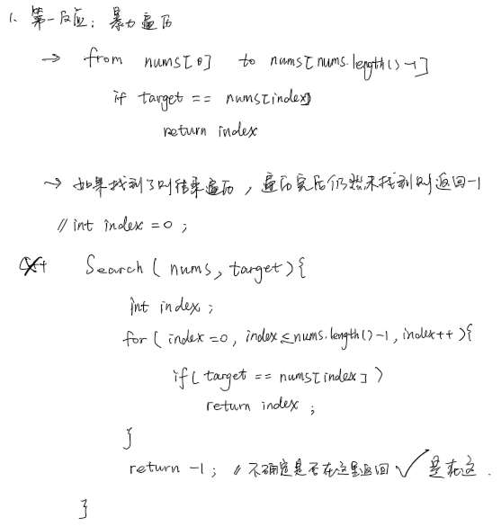

**2024.6.12**  22:24
## 难度 <span style="color:green">Easy</span>
link: https://leetcode.cn/problems/binary-search/description/
tag: 数组，二分查找
## 题目
给定一个 n 个元素有序的（升序）整型数组 `nums` 和一个目标值 `target`  ，写一个函数搜索 `nums` 中的 `target`，如果目标值存在返回下标，否则返回 -1。


**示例 1:**

输入: `nums` = [-1,0,3,5,9,12], `target` = 9
输出: 4
解释: 9 出现在 `nums` 中并且下标为 4
**示例 2:**

输入: `nums` = [-1,0,3,5,9,12], `target` = 2
输出: -1
解释: 2 不存在 `nums` 中因此返回 -1
 

**提示：**

你可以假设 `nums` 中的所有元素是不重复的。
`n` 将在 `[1, 10000]`之间。
`nums` 的每个元素都将在 `[-9999, 9999]`之间。
## 题解 (非最优解)
### C++
```c++
class Solution {
public:
    int search(vector<int>& nums, int target) {
        auto it = nums.begin();
        int index = 0;
        while(it != nums.end())
        {
            if(*it == target)
            {
                return index;
            }
            else{
                it++;
                index++;
            }
        }
        return -1;
    }
};
```
**思路：**
C++ vector使用迭代器遍历
首先新建一个迭代器
`auto it = nums.begin();`   指向数组的第一个元素
使用`while（\*it ！= nums.end()）`作为循环条件

### Java
#### 顺序遍历法
```java
class Solution {
    public int search(int[] nums, int target) {
        // 使用属性 length 而不是 length() 方法
        // 同时让循环条件为 index < nums.length
        for(int index = 0; index < nums.length; index++) {
            if(target == nums[index]) {
                return index;//return 直接break整个function
            }
        }
        return -1; // 没找到则返回 -1
    }
}
```
**思路**<br>


#### 二分查找（最优解）
```java
class Solution {
    public int search(int[] nums, int target) {
       int low = 0;
       int high = nums.length-1;
       int mid;
       
       while(low <= high){
            mid = (low + high) / 2;
            if(nums[mid] == target){
                return mid;
            }else if(nums[mid] > target){
                high = mid - 1;
            }else{
                //mid < target
                low = mid +1;
            }

       }
       return -1;
    }
}
```