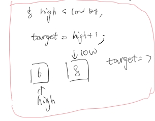

**2025.1.4** 23:00
## 难度 <span style="color:green">Easy</span>
link: https://leetcode.cn/problems/search-insert-position/description/ <br>
tag: 数组，二分查找
## 题目
给定一个排序数组和一个目标值，在数组中找到目标值，并返回其索引。如果目标值不存在于数组中，返回它将会被按顺序插入的位置。

请必须使用时间复杂度为 O(log n) 的算法。

 

**示例 1:**

输入: nums = [1,3,5,6], target = 5
输出: 2<br>
**示例 2:**

输入: nums = [1,3,5,6], target = 2
输出: 1<br>
**示例 3:**

输入: nums = [1,3,5,6], target = 7
输出: 4<br>
 

**提示:**

1 <= nums.length <= 10^4<br>
-10^4 <= nums[i] <= 10^4<br>
nums 为 无重复元素 的 **升序** 排列数组<br>
-10^4 <= target <= 10^4<br>
## 题解
```java
class Solution {
    public int searchInsert(int[] nums, int target) {
        int low = 0;
        int high = nums.length-1;
        int mid;

        while(low <= high){
            mid = (low + high) / 2;
            if(nums[mid] == target)
                return mid;
            else if(nums[mid] < target){
                low = mid +1;
            }else{
                high = mid -1;
            }
        }
        return high + 1;
    }
}
```
只在基础二分查找 <a href='day3 704.二分查找（Easy).md'>LeetCode704</a> 的基础上改了一点点，重点是找到因为数组中不存在target而跳出while循环时high，mid，low的相对位置，自己举例子画一画就出来了。<br>
