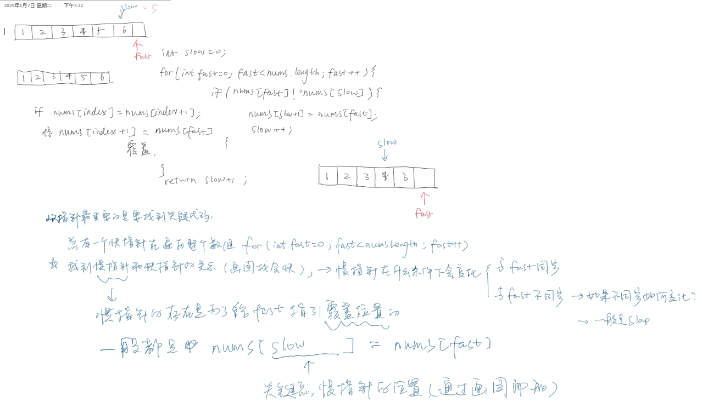

**2025.1.8** 19:37
## 难度 <span style="color:green">Easy</span>
link: https://leetcode.cn/problems/remove-duplicates-from-sorted-array/description/ <br>
tag：数组，双指针<br>
关联题目：<a href='day8 27.移除元素(Easy).md'>27.移除元素-Easy</a>
## 题目
给你一个 **非严格递增排列** 的数组 `nums` ，请你 **原地** 删除重复出现的元素，使每个元素只出现一次 ，返回删除后数组的新长度。元素的 **相对顺序** 应该保持 一致 。然后返回 `nums` 中唯一元素的个数。<br>

考虑 `nums` 的唯一元素的数量为 `k` ，你需要做以下事情确保你的题解可以被通过：<br>

更改数组 `nums` ，使 `nums` 的前 `k` 个元素包含唯一元素，并按照它们最初在 `nums` 中出现的顺序排列。`nums` 的其余元素与 `nums` 的大小不重要。
返回 `k` 。
 
**示例 1：**<br>
输入：`nums = [1,1,2]`<br>
输出：2, `nums = [1,2,_]`<br>
解释：函数应该返回新的长度 `2` ，并且原数组 `nums` 的前两个元素被修改为 1, 2 。不需要考虑数组中超出新长度后面的元素。
**示例 2：**<br>
输入：`nums = [0,0,1,1,1,2,2,3,3,4]`<br>
输出：5, `nums = [0,1,2,3,4]`<br>
解释：函数应该返回新的长度 5 ， 并且原数组 `nums` 的前五个元素被修改为 `0, 1, 2, 3, 4` 。不需要考虑数组中超出新长度后面的元素。<br>
 

**提示：**
1 <= `nums.length` <= 3 * 10^4<br>
-10^4 <= `nums[i]` <= 10^4<br>
`nums` 已按 **非严格递增** 排列
## 题解
```java
class Solution {
    public int removeDuplicates(int[] nums) {
        int slow = 0;

        for(int fast = 0; fast < nums.length; fast++){
            if(nums[fast] != nums[slow]){
                nums[slow+1] = nums[fast];
                slow++;
            }
        }
        return slow+1;
    }
}
```


### 🆘注意
**非严格递增序列**：`1,2,3,3,4,5,5,5,6`, 即序列中后一个元素不小于前一个元素（≤）。与“**非递减序列**”意义相同，都表示的是：`a1 ≤ a2 ≤ a3 ≤ ⋯ ≤ an`
​