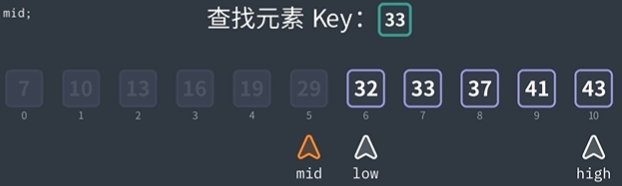

# 二分查找（Binary search）
二分查找也叫折半查找。每次操作都会将数组划分成两个部分，直到查找到元素或者划分到最小为止。
<a href='https://www.bilibili.com/video/BV1Vw4m1Y7NQ/?spm_id_from=333.337.search-card.all.click&vd_source=9d8f6fe56371abfae7fe0a76b8a06bab' target="_blank">二分查找简要介绍-bilibili（动画易于理解）</a>
## 时间复杂度
O(logN） 
## 使用条件
1. 有序数组（升序或者降序）
2. 数据结构需要满足==随机访问==（e.g. array)， 数据结构如链表就不可以 

  ❣️折半查找在初始化时创建3个变量：low指向索引0，high指向最后一个索引，还有一个mid（middle）不赋值。
折半查找在找不到中间元素时就取**左侧元素为中间元素**，因为mid的int行会自动在除法后保留浮点数的整数部分，**比如**（6和7之间的元素，6+7=13，13/2=6.5保留6, 所以mid=6）
## 核心代码
```c++
typedef struct{
    ElemType *elem;//元素存储空间地址
    int TableLen;//表长度
} SSTable //search seq table

int Binary_Search(SSTable ST, ElemType target){
    int low = 0, high = ST.TableLen-1, int mid;//initial three variables

    while(low <= high) {
        mid = (low + high) / 2; //取中间位置
        if(ST.elem[mid] == target)//查找成功
            return mid;
        else if (ST.elem[mid] > target)
            high = mid - 1;//target在mid左侧，所以要把high移到mid左侧的一个位置
        else
            low = mid + 1;//target在mid右侧
    }
    return -1；
}
```
## ❗记忆点
1. while 循环条件是 `low <= high`
2. 如果 `mid < target`, 证明target在mid的右侧，那么 `low = mid + 1 `

3. 如果 `mid > target`, 证明target在mid的左侧，那么 `high = mid - 1`